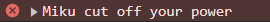
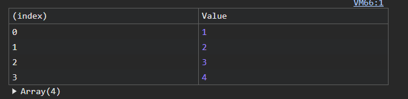

## Assignment 2

### About this repository/assignment

- [External.html](./external.html): Example of console log outside of html file
- [External.js](./external.js): Has the console log script
- [Inline.html](./inline.html): Example of console log inside of html file, has the console log script
---

### Notes

**How to open console in browser (for windows)** 
| Browser       | Shortcut         |
| ---------     | ---------------- |
| Chrome        | Ctrl + Shift + J | 
| Firefox       | Ctrl + Shift + K | 
| Opera         | Ctrl + Shift + J |
or just do F12

---

**Console Methods**

syntax
```markdown
console.log("Miku Miku beeeeeeeeeeam")
```
output
> 
***
syntax
```markdown
console.warn("Miku is in your walls")
```
output
> 
***
syntax
```markdown
console.error("Miku cut off your power")
```
output
> 
***
syntax
```markdown
console.table([1, 2, 3, 4])
```
output
>
***
syntax
```markdown
console.clear()
```
output
```
```
***

